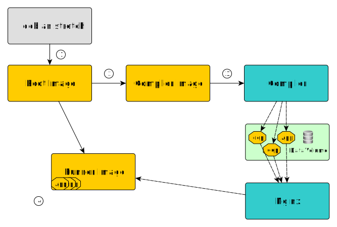

How the Docker image is built
=============================

The final Docker image, which we'll call the **runner** image from now on, is built
in four phases:

1. First, the **root** image is built from the official **debian:jessie** image. In this phase
   all of the image's runtime dependencies are installed.
2. Then the **compiler** image is built from the **root** image. In this image all
   of the build dependencies are installed, and a compiler script is added.
3. The third step is to run the **compiler** image and build Python wheels
   for the application and its dependencies. Those wheels are stored in a Docker data volume.
4. Finally, the wheels stored in the data volume are exposed using a web server (using a
   docker container) and the final **runner** image is built from the **root** image, using the wheels.

There is one **root** image and one **compiler** image by *config* (see :ref:`grocker_yml`).
The wheel data volume is reused between builds with the same *config*.

Grocker ends up building three Docker images, two of which are reused between each build using
the same *config*:

1. The **root** image, which contains all (system) runtime dependencies
2. The **compiler** image, which is the **root** image extended with (system) build dependencies
   including a C compiler and a compiler script allowing to build all needed wheels from a
   package name.

The last image is the **runner**, the final product of the Grocker build chain,
which contains the application and all its dependencies (excluding external services).
